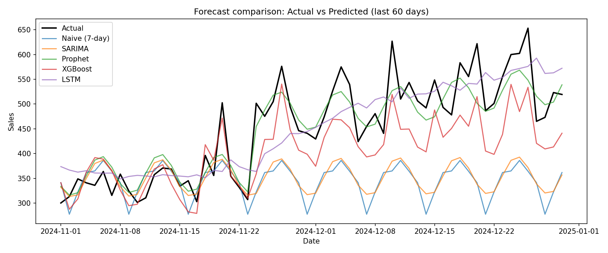

# IBIP
# INTERN INFOBYTE INTERNSHIP — Sales Forecasting Pipeline

🔗 **Live dashboard:** https://lpwzqurrpgvwffnzr6rkly.streamlit.app/

An end-to-end sales forecasting project comparing four different modeling
approaches — classical statistical, decomposable, machine learning, and deep
learning — on the same dataset, with proper time-aware validation and a
deployed interactive dashboard.

## 📊 Results

| Model | RMSE | MAE | MAPE (%) |
|---|---|---|---|
| **Prophet** ✅ | 41.36 | 32.28 | **7.08** |
| LSTM | 60.00 | 47.74 | 10.55 |
| XGBoost | 66.26 | 55.92 | 11.65 |
| SARIMA | 135.67 | 110.65 | 21.91 |
| Naive (7-day) baseline | 142.46 | 117.28 | 23.46 |

**Prophet was the best-performing model, cutting forecast error by ~70%
compared to a naive 7-day-lag baseline**, validated using walk-forward
(time-aware) evaluation rather than a random train/test split.



## 🧠 What this project demonstrates
- Comparing 4 fundamentally different forecasting paradigms on one problem
- Feature engineering for time series: lags, rolling statistics, calendar/holiday effects
- Walk-forward validation — avoiding the classic mistake of a random split leaking future data into training
- Translating error metrics into a business-relevant improvement number
- Deploying a working model as a live, interactive product (not just a notebook)

## 🛠 Tech stack
`Python` · `pandas` / `numpy` · `statsmodels` (SARIMA) · `Prophet` · `XGBoost` · `TensorFlow/Keras` (LSTM) · `scikit-learn` · `Streamlit`

## 📁 Project structure
```
IBIP/
├── data/
│   └── sales.csv                  # daily sales data (date, sales, promo, holiday)
├── outputs/
│   ├── comparison.csv             # model comparison metrics
│   └── forecast_comparison.png    # actual vs predicted chart
├── data_prep.py                   # generates/loads the sales dataset
├── feature_engineering.py         # lag, rolling, and calendar features
├── train_models.py                # trains & compares SARIMA, Prophet, XGBoost, LSTM
├── dashboard.py                   # Streamlit dashboard (deployed live)
├── requirements.txt
└── README.md
```

## ▶️ Run it yourself
```bash
git clone https://github.com/jsangamithra/IBIP.git
cd IBIP
pip install -r requirements.txt

python data_prep.py            # generate/refresh the dataset
python feature_engineering.py  # build model features
python train_models.py         # train all 4 models & save comparison
streamlit run dashboard.py     # launch the dashboard locally
```

## 📈 Methodology
1. **Data:** Daily sales series with trend, weekly/yearly seasonality, promotions, and holiday effects.
2. **Feature engineering:** Lag features (1/7/14/30 days), rolling mean/std (7/14/30-day windows), and calendar features (day of week, month, quarter, weekend flag) — all computed without leaking future information.
3. **Validation:** Walk-forward split — models are trained only on data *before* a 60-day test window, never on future data.
4. **Evaluation:** RMSE, MAE, and MAPE, benchmarked against a naive 7-day-lag baseline.
5. **Deployment:** Results and forecasts served through a Streamlit dashboard for interactive exploration.

## 🔮 Possible extensions
- Swap in real retail data (e.g. Walmart/Rossmann Kaggle datasets)
- Add SHAP explainability for the XGBoost model
- Extend to multi-store / hierarchical forecasting
- Add confidence intervals to the forecast chart

---
*Built as part of an ML internship project — taken beyond the base
requirements to a deployed*
